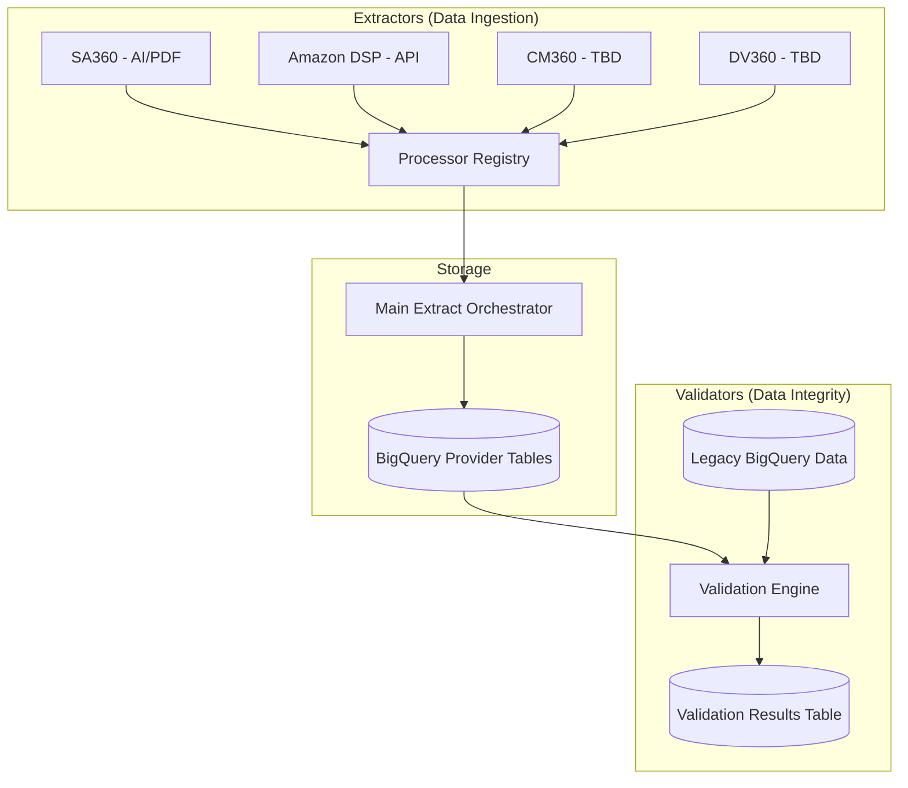

# 📄 Invoice Extractor 2.0

A high-performance, automated system for extracting and validating advertising invoices across multiple platforms. This system bridges the gap between raw invoice documents (PDFs) or API data and BigQuery analytics, ensuring data integrity through automated business rule validation.

---

## 🏗️ Architecture Overview

The project uses a **Registry-based Orchestration** pattern to handle multiple platforms uniformly.



---

## 📁 Project Structure

| Directory | Description |
| :--- | :--- |
| `invoice_extractor/core/` | **The Brain**: Central configuration (`config.py`), base classes (`base.py`), and AI extractor logic (`extractors.py`). |
| `invoice_extractor/extractor/` | **Data Fetchers**: Platform-specific logic for fetching and parsing invoices. |
| `invoice_extractor/validators/` | **The Auditor**: Business rules and comparison logic between sources. |
| `invoice_extractor/utils/` | **Common Tools**: BigQuery handlers, file cleaners, and AI vision helpers. |
| `invoice_extractor/data/` | local workspace for temporary files and local invoice storage. |

---

## 🚀 Quick Start

### 1. Installation

**Activate your virtual environment** (if you have one):
```bash
source ../.venv/bin/activate  # From the invoice_extractor directory
```

**Install the package in editable mode:**
```bash
pip install -e .
```

### 2. Configuration
Create a `.env` file in the root directory:
```env
API_KEY_OPENAI=sk-your-key-here
```

Ensure your Google Cloud Service Accounts are present in the `invoice_extractor/` subdirectory:
- `invoice_extractor/service-account.json`: Access to provider APIs.
- `invoice_extractor/service_account_pads.json`: Access to BigQuery dataset.

### 3. Execution

**Extract Data (Option 1 - Using helper script):**
```bash
./run_extract.sh
```

**Extract Data (Option 2 - Direct command):**
```bash
python3 -m invoice_extractor.extractor.main_extract
```

**Validate Data (Option 1 - Using helper script):**
```bash
./run_validate.sh
```

**Validate Data (Option 2 - Direct command):**
```bash
python3 -m invoice_extractor.validators.validate
```

---

## 🛠️ Development Guides

We've provided detailed guides for extending the platform:

- [**How to add a new Platform Extractor**](invoice_extractor/extractor/README.md)
- [**How to add a new Data Validator**](invoice_extractor/validators/README.md)

---

## ✨ Features

- **Multi-Modal AI Extraction**: Uses GPT-4o Vision for complex PDFs with Gemini fallback.
- **Unified Orchestration**: Add new platforms by simply registering them with the `@ProcessorRegistry`.
- **Automated Validation**: Compare provider data against historical BigQuery data with customizable business rules.
- **Scalable BigQuery Integration**: Automatic schema generation and deduplication based on invoice numbers.

---

> [!NOTE]
> This project is designed for extensibility. All platform-specific code is decoupled from the core orchestration logic.
